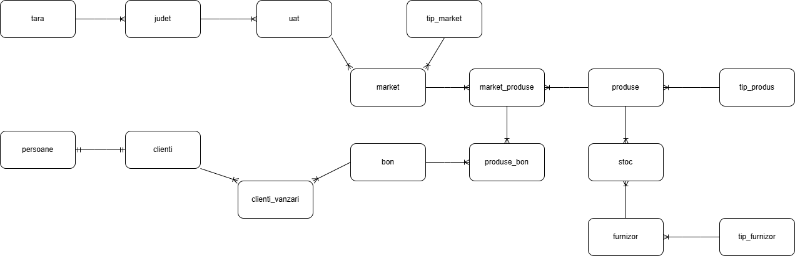

**ENUNT PROIECT**

Există o rețea de supermarketuri care dorește să își mapeze locațiile existente și ulterior să se extindă în zone neacoperite conform planurilor de management. Odată cu maparea supermarketurilor existente se dorește și implementarea unui sistem de urmărire a vânzărilor, a stocurilor existente dar și a necesarului de aprovizionaree și comunicare directă cu furnizorii.

Entități:
•	Țară, județ, UAT
•	Supermarket, tip_market
•	Vânzări, clienți, date_client
•	Stoc, produse
•	Furnizori, date_furnizori

